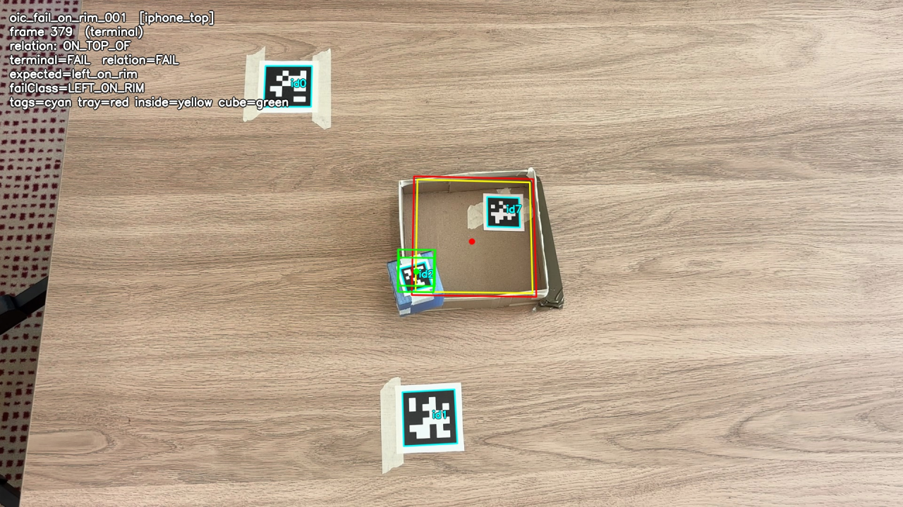

# Baseline counterexamples — terminal predicates encode a weaker task

> **These examples do not show that wide-robot beats a bad predicate.**
> They show that common *terminal* predicates encode a **weaker question** than the
> task actually asks. wide-robot checks the whole object-state story — role
> existence, **initial** state, **terminal** containment, the **transition** between
> them, **evidence confidence**, and **leakage** discipline. A single-condition
> terminal predicate checks only the last of those, so it answers "is the object
> at a spot that looks like success in the final frame?" — not "did the *task*
> happen?"
>
> This is **single-condition terminal predicate vs. structured, leakage-clean
> verifier** — *not* learned-verifier vs. hand-coded predicate. Every predicate
> here, including the baselines, is hand-coded; they differ only in **how much of
> the task definition they encode**. We include two *strong* baselines so the
> comparison is honest, not a strawman:
>
> - **B5** = the verifier's own `csg.is_inside` on the last frame — the *strongest
>   single-frame terminal predicate*. It closes the rim (rim-height aware) but
>   **still false-PASSes born-inside (10/40)**: a terminal state cannot encode a
>   *transition*.
> - **B4** = contained **and started-outside** — a *two-frame* predicate that adds
>   exactly the missing initial-state check. It **rejects born-inside and reaches
>   0/40 false-PASS, matching the structured verifier.** That is not a hole in the
>   argument; it *is* the argument — the task is an outside→inside transition, so
>   you must read more than the terminal frame.
>
> So what does the structured verifier buy *over even B4*? Two specific things, with
> their limits stated: (1) a **fail-closed evidence gate** — on the occluded clip
> **every** single/two-frame baseline including B4 certifies a success the verifier
> refuses (it could not see the trajectory); honest caveat: that gate is *target-blind*
> and *separable*, so any baseline could bolt it on. (2) a **real relation-transition**
> instead of B4's brittle two-endpoint "started-outside + ended-inside" proxy (more
> robust to non-continuous / decoy transitions, though this dataset does not stress
> that), plus leakage discipline and the *same* target running across
> MuJoCo / RLBench / RH20T. The honest per-baseline scoreboard (below) shows the
> full tradeoff: **B4 even out-recalls the verifier (32 vs 27 successes)** precisely
> because it does *not* fail-close on occlusion.
>
> - **B6** = B4 **+ the verifier's own evidence gate** — the *engineered steelman*. We
>   built the strongest honest baseline we could, and it **ties the structured
>   verifier's entire scoreboard (27/38 cert, 0/40 false-PASS, the same numbers)**. We
>   say so plainly: **a sufficiently engineered task-specific predicate *can*
>   approximate this one task.** It does so by *importing the verifier's own evidence
>   gate* — i.e. by reimplementing the very structure wide-robot bundles.
>
> So the defensible claim is not "no predicate can match the verifier on this task" —
> B6 does. The claim is the one the scoreboard and the **baseline engineering-cost
> table** make: **terminal predicates fail outright; stronger task-specific predicates
> can be built, but they accumulate hidden assumptions** (footprint → dimensions →
> margin → rim height → initial state → evidence thresholds), each baked into bespoke
> per-task code. **wide-robot externalizes those assumptions as an auditable task
> graph** — initial-state, transition, evidence quality, diagnostics, and leakage
> discipline — read by **one frozen engine reused across tasks** (see the cross-task
> open-drawer example). The win is not "uncatchable verdicts," it is *making the
> structure explicit, auditable, reusable, and leakage-clean instead of re-derived
> per task*. The honest scope on terminal predicates remains "insufficient, including
> the strongest single-frame one (B5)."

All evidence below is real: 78 committed Sony/iPhone `object_inside_container`
clips (`datasets/sony_object_inside_container_v0/`), scored by the ladder in
[`baseline_predicates.py`](baseline_predicates.py) and by the **frozen**
`csg.matcher` through `pilots.real_camera.verify_episode`. `csg/` is read-only
here. Reproduce — with **no OpenCV and no raw video** (the tests pass with cv2
import-blocked and the mp4s removed):

```bash
python3 -m scripts.build_baseline_counterexamples          # full (renders overlays; needs cv2 + local mp4s)
python3 -m scripts.build_baseline_counterexamples --no-overlays   # JSON/CSV/MD only
python3 -m pytest tests/test_baseline_counterexamples.py -q       # no video / no cv2 required
```

## The baseline ladder

Six hand-coded "did the cube end up in the tray?" checks, climbing in strictness.
B1–B5 read at most the **first and last** frame and use the *same* box geometry as
the verifier (`csg.predicates`); **B6** adds the verifier's own evidence gate, so the
comparison runs from "naive" all the way to a fully-engineered steelman:

| id | question it answers |
|----|---------------------|
| **B1** center-in-footprint | terminal cube **center** within the tray's outer footprint (2D, ignores rim height) |
| **B2** footprint-overlap | terminal cube **footprint** overlaps the tray footprint ≥ 0.5 (2D) |
| **B3** full-inner-containment | terminal cube footprint **fully** inside the shrunk inner region (2D, 5 mm margin) |
| **B4** contained + started-outside | B3 **and** the cube started outside the footprint (2D + initial state) |
| **B5** terminal-3D-containment | **`csg.is_inside` on the last frame**: shrunk footprint **and** rim height (3D) — the maximal single-frame terminal predicate |
| **B6** + evidence-gated | B4 **and** the verifier's own fail-closed evidence gate (`assess_evidence_quality`) — the engineered steelman that ties the verifier's scoreboard |

Note the dividing line: **B1/B2/B3/B5 read essentially the terminal frame**, so
none of them can reject **born-inside** (the cube ends inside). **B4 is the
exception** — it also reads the **first** frame ("started outside"), exactly what a
put-in requires, so it *does* reject born-inside. What **no** baseline here has is a
**fail-closed evidence gate**: on a mid-trajectory occlusion all of B1–B5 certify
from the clean first/last frames. B1/B2 additionally ignore the **rim height**,
which B5 fixes. The honest per-baseline scoreboard is below.

## Three lessons, escalating

| clip | human | B1 | B2 | B3 | B4 | **B5 (max terminal)** | wr terminal_only | wr structured | lesson |
|---|---|---|---|---|---|---|---|---|---|
| `oic_fail_on_rim_001__iphone_top` | rim FAIL | **PASS** | **PASS** | reject | reject | **reject** | FAIL/LEFT_ON_RIM | FAIL/LEFT_ON_RIM | **dimensionality**: 2D center → 3D containment |
| `oic_control_inside_to_inside_001__sony_front` | born-inside FAIL | **PASS** | **PASS** | reject | reject | **PASS** ❗ | **PASS** ❗ | FAIL/BORN_INSIDE_NO_TRANSITION | **transition**: only the initial-state check rejects it |
| `oic_success_005__iphone_top` | success (occluded) | PASS | PASS | PASS | PASS | **PASS** ❗ | UNCERTAIN | UNCERTAIN | **evidence**: 50-frame dropout, fail-closed |

Read top to bottom, the gap that survives gets deeper:

1. **Rim — a dimensionality lesson, stated honestly.** A single-condition center
   predicate (B1) calls it a success because the cube's center, projected straight
   down, lands inside the footprint. The verifier rejects it (`ON_TOP_OF`, not
   `INSIDE`) — and so does **B5** and even the verifier's *weakest* `terminal_only`
   target. So the rim does **not** require "structure"; it requires **rim-height
   awareness**. We keep it as the visual flagship (below) because it is the most
   legible failure, but the honest claim is "a *single-condition* terminal predicate
   is insufficient," not "only a structured verifier can catch this."

2. **Born-inside — terminal state is not enough; you need the transition.** The
   cube is inside the whole time; it is never *placed*. It ends inside, so **every
   single-frame terminal predicate PASSES** — including the maximal **B5** and the
   verifier's weak `terminal_only` target. Rejecting it requires reading the
   **initial** state, and **both** `B4` (its started-outside clause) **and** the
   structured targets (`initial_state`) do — both reject it. So this is *not* "only
   the structured verifier can catch born-inside"; it is "you must look at more than
   the terminal frame." B4 is a hand-coded, two-frame proof of exactly that; the
   structured target does the same via the relation transition. The honest gap B4
   does *not* close is the next lesson.

3. **Occlusion — an evidence-discipline gap (separable, not "structure").** A
   genuine success, but the cube marker is occluded for **50 consecutive frames**.
   The first and last frames look perfect, so **every baseline including B5
   certifies it**. wide-robot returns UNCERTAIN via its fail-closed evidence gate
   (`assess_evidence_quality`). Crucially — and we say so plainly — that gate is a
   **target-blind preprocessing check** that runs *before* the matcher and depends
   only on `(tracks, thresholds)`; it is **separable** and any baseline could adopt
   the identical check. So occlusion shows the value of **fail-closed evidence
   discipline**, which wide-robot bundles in, not the value of structure per se.
   This is the one lesson that separates the verifier from **even B4**: on this
   clip B4 (and every baseline) certifies; only the gated verifier returns
   UNCERTAIN.

**The sharpened thesis (honest scope):** a *single-frame* terminal predicate — even
the maximal one (B5) — cannot reject born-inside, because the task is a
**transition**, not a terminal state. Closing born-inside needs the **initial**
state too: B4 (two frames) does it, and so does the structured verifier — so the
born-inside lesson is "terminal state underspecifies the task," not "only the
verifier can judge it." Over and above a strong two-frame baseline like B4, the
structured verifier adds only two specific things — a **fail-closed evidence gate**
(separable, bolt-on-able) and a **real relation-transition** check (vs B4's
two-endpoint proxy) plus leakage discipline and cross-source portability. The
scoreboard makes the tradeoff explicit, including where B4 *beats* the verifier
on recall.

## The flagship visual: `oic_fail_on_rim_001__iphone_top`



The cube is **left balanced on the rim** (green wireframe on the near edge,
terminal frame 379). Its center lands inside the tray's outer footprint (red), so
B1/B2 say success; the verifier sees `ON_TOP_OF` and says **FAIL / LEFT_ON_RIM**.

### Robustness — the rejection is solid, the spurious PASS is not
Quantified in [`cases/rim_edge/robustness_perturbation.json`](cases/rim_edge/robustness_perturbation.json)
(14 calibration perturbations: tray center ±5/±10 mm in x and y, cube size 4–6 cm):

- **wide-robot `terminal_only` is NEVER PASS** across all 14 perturbations — the
  cube sits **+26 mm above the rim+slack**, a large margin. B5 likewise rejects in
  all 14. The verifier's rejection is **calibration-robust**.
- **B1's PASS is knife-edge**: the cube center is only **+5.4 mm** inside the
  nearest (back) footprint edge, so a single ~10 mm shift (`tray_y-10mm`) flips B1
  to reject. We disclose this rather than imply the PASS is robust — and it
  *reinforces* the lesson: a height-blind center test is not just wrong on the rim,
  it is **unstably** wrong, resolving a boundary case by ignoring the very quantity
  (height) that decides containment.

This is also the **only** one of the six `left_on_rim` clips where B1 PASSes (the
other five have the cube center *outside* the footprint, so there is no false
certification to overturn) — the calibration sensitivity is load-bearing and we
say so.

## Aggregate over all 78 clips

(see [`results_table.md`](results_table.md) / [`results_table.csv`](results_table.csv))

**40** clips are human-non-successes; **38** are human-successes. Per-baseline
scoreboard — success-certifications vs. false-PASSes, nothing hidden (this table is
regenerated into [`results_table.md`](results_table.md)):

| predicate | kind | success-cert | false-PASS / 40 |
|---|---|---|---|
| B1 center-in-footprint | naive single-frame | 35/38 | 11 |
| B2 footprint-overlap | naive single-frame | 35/38 | 11 |
| B3 full-inner-containment | naive single-frame | 32/38 | 6 |
| **B4** contained + started-outside | naive two-frame | **32/38** | **0** |
| B5 terminal-3D-containment (max single-frame) | naive single-frame | 33/38 | 10 |
| **B6** contained + started-outside + evidence-gated | **engineered (B4 + evidence gate)** | **27/38** | **0** |
| wr `terminal_only` (weak target) | verifier (weak) | 27/38 | 3 |
| **wr structured** (`relation_event` ∨ `placed_from_outside`) | verifier (structured) | **27/38** | **0** |

Reading it honestly:
- **Single-frame terminal predicates** (B1/B2/B3/B5) all false-PASS born-inside; even the maximal **B5 false-PASSes 10/40**. Terminal state underspecifies the task.
- **B4** adds a started-outside check and reaches **0/40 false-PASS — equal to the structured verifier** — and even **out-certifies it on successes (32 vs 27)** because it does not fail-close on occlusion. So the win over a *terminal* predicate is real and large; the win over a good *two-frame* baseline is narrow and specific (fail-closed evidence gate + a real transition vs a two-endpoint proxy + leakage/cross-source), and it is a recall-vs-evidence-honesty **tradeoff**, not a clean dominance.
- **B6** is the engineered steelman: B4 with the verifier's **own** fail-closed evidence gate bolted on. It **ties the structured verifier's entire scoreboard — 27/38 cert, 0/40 false-PASS, the same numbers** — by no longer certifying the occlusion successes B4 over-certifies. **So a sufficiently engineered task-specific predicate *can* approximate this one task.** It is not a clip-for-clip identity, though: B6 and the verifier disagree on **4 successes that cancel** (B6's full-footprint containment is stricter than the verifier's center-based `is_inside`, so it rejects 2 the verifier certifies; B6's raw-center read certifies 2 obstruction successes the verifier hard-FAILs). See [`b6_vs_structured.json`](b6_vs_structured.json).
- B4's 0 false-PASS holds on *this* dataset; with no evidence gate it would also certify an occluded *failure* (the dataset happens not to contain one), which the structured verifier's UNCERTAIN posture would refuse.
- On the 38 successes, structured certifies **27**, UNCERTAINs **5** (occlusion), hard-FAILs **6** (obstruction — see limitation).

## Baseline engineering cost — the ladder reimplements wide-robot

The reason B6 has to *import* the verifier's gate is the real point. Each rung adds an
assumption the previous one lacked; by B6 the "baseline" has re-derived (or borrowed)
every component wide-robot already has — as bespoke, per-task code. (Generated into
[`engineering_cost.json`](engineering_cost.json).)

| predicate | what it must know | what it reimplements | form |
|---|---|---|---|
| B1 / B2 | tray footprint (XY rectangle) | terminal containment (2D, rim-blind) | bespoke predicate code |
| B3 | cube + tray dimensions, containment margin (still 2D, rim-blind) | the verifier's footprint-containment geometry (a cube 1 m *above* the tray still passes B3) | bespoke predicate code |
| B5 | + rim height (the z test B3 lacks) | the verifier's **full 3D** `csg.is_inside` (footprint **and** rim height) | bespoke predicate code |
| B4 | + initial-state semantics (started outside) | the outside→inside transition (two-endpoint proxy) | bespoke predicate code |
| B6 | + evidence-quality thresholds | the fail-closed evidence gate — here by **importing** `assess_evidence_quality` | bespoke code + bolt-on of the verifier's gate |
| **wide-robot** | the same assumptions, **declared as data** in the target graph | **nothing per-task**: one frozen engine reads the graph; transition / evidence / leakage are reusable components | declarative task graph + frozen verifier |

The ladder is the argument in motion: climbing it gradually rebuilds wide-robot's pieces
as one-off code, until B6 reaches parity only by reusing the verifier's own gate.
wide-robot declares the **same** assumptions once, as an auditable graph, and a single
frozen engine applies them — across tasks (next section).

## Deterministic fixtures — the semantics, with calibration off the table

The 78 real clips prove the issue *visually*, but their geometry comes from physical
marker calibration, so a skeptic can ask "is that just your tray corners?". The
hand-authored fixtures in [`fixtures/`](fixtures/) remove that question: round-number
poses, the canonical tray at `(0.30, 0, 0.015)` size `[0.24, 0.18, 0.03]`, a `0.04 m`
cube — **nothing to calibrate**. Each isolates one semantic
([`fixtures/fixture_results.json`](fixtures/fixture_results.json) holds the recompute +
the asserted expectations the test pins):

| fixture | human | B1 | B3 | B4 | B5 | B6 | wr terminal | wr relation | occupancy-strawman |
|---|---|---|---|---|---|---|---|---|---|
| `fx_outside_to_inside_success` | success | PASS | PASS | PASS | PASS | PASS | PASS | PASS | PASS |
| `fx_rim_partial` | fail | **PASS** | reject | reject | reject | reject | FAIL/RIM | FAIL/RIM | PASS |
| `fx_born_inside` | fail | PASS | PASS | reject | **PASS** | reject | PASS | FAIL/BORN | PASS |
| `fx_inside_to_inside` | fail | PASS | PASS | reject | **PASS** | reject | PASS | FAIL/BORN | PASS |
| `fx_occluded_uncertain` | success | PASS | PASS | PASS | PASS | reject | UNCERTAIN | UNCERTAIN | PASS |
| `fx_wrong_object` | fail | reject | reject | reject | reject | reject | FAIL | FAIL | **PASS** ❗ |
| `fx_leaky_metadata` | (rollout) | — | — | — | — | — | — | clean **PASS** → leaky **UNCERTAIN** | — |

(`fx_leaky_metadata` is rollout-only — the identical rollout is `PASS` clean and
`UNCERTAIN`/`leakage_violation` once a source role name is injected into `objectIdMap`.)

These are **7 fixtures, 6 distinct verifier outcomes**: `fx_born_inside` (a 2 cm jitter)
and `fx_inside_to_inside` (a 16 cm traverse) produce **byte-identical records** (both
`BORN_INSIDE_NO_TRANSITION`) — kept on purpose as an *invariance* demonstration that the
verdict does not depend on how far the object moves *inside* the tray; it is the missing
transition, not the motion, that decides. Each remaining row is a clean statement: the
**rim** separates 2D-center (B1) from 3D containment (B3/B5/verifier); **born-inside /
inside→inside** PASS every terminal predicate (incl. maximal B5) but fail the
initial-state check (B4/B6/verifier); **occlusion** is certified by B1–B5 but refused by
B6 and the verifier (the consecutive-missing evidence gate — sized so dropout stays under
threshold, isolating that rule); **wrong-object** fools the identity-blind occupancy
strawman (a decoy sits in the tray) while the cube-bound ladder and the verifier reject;
**leaky-metadata** is the same evidence PASSing clean but refused once a source role name
leaks into `objectIdMap` — a gate the baselines have no notion of.

## Cross-task — one frozen engine, the task supplied as data

The whole ladder is bespoke *cube-in-tray* code; it means nothing for another task. The
structured verifier is different: the engine
([`pilots.external_verify.verify_external_rollout`](../../pilots/external_verify.py) over
the frozen `csg.matcher`) is **task-agnostic — the task is a `csg.v0` target graph**.
Proven executably in [`cross_task/cross_task_report.json`](cross_task/cross_task_report.json):

- **engine identity**: the function object imported by the real-camera pilot **is the same
  object** imported by the RLBench pilot (`x is y` ⇒ `True`, both directions). Not "similar
  code" — the identical function.
- **open_drawer** (a different task class: prismatic-joint articulation, not containment)
  PASSes on all **9 committed live RLBench drawer rollouts** through that engine —
  leakage-clean, non-vacuous, all articulation probes supported, and (honestly)
  **physics-unverified** (`physicalValidity` null on every demo, as for any external
  kinematic trace — an honest kinematic PASS, not a physics-validated one).
- **same engine, same drawer rollout, two targets**: `open_drawer` → PASS,
  `object_inside_container` → FAIL. *The target is the task* — no engine code changes.
- the cube/tray **baseline ladder is inapplicable** to a drawer (no cube, no tray, no
  footprint; the success quantity is a joint extension, not XY containment). Scoring
  open_drawer with a "baseline" means a brand-new predicate from scratch; the verifier
  swaps a JSON target.

**Honest scope of "task = data".** Both tasks live within the frozen matcher's *existing*
probe vocabulary (containment uses `relation_transitions` / `object_carrier`; the drawer
uses `articulation_transitions`) — which is *why* swapping only the target works. A
genuinely novel task needing a probe family the matcher does not have would extend the
frozen engine, not just the data. So "one engine, task = data" is demonstrated *within*
the current probe families (relation / articulation / contact / goal / event), not as a
claim about arbitrary task families.

### Reproducibility + independent corroboration
- **Reproducibility** ([`reproducibility_check.json`](reproducibility_check.json)):
  our recompute reproduces the verdicts stored in the committed dataset on
  **78/78 clips, 0 disagreements**. *Honest scope:* `verdicts_all.json` is produced
  by `scripts/ingest_recordings.py` calling the **same** `verify_episode`, so this is
  a regression/reproducibility check (the experiment uses the production verifier
  unchanged) — **not** independent corroboration.
- **Independent geometry** ([`independent_geometry_check.json`](independent_geometry_check.json)):
  a **from-scratch** reimplementation of the terminal-containment geometry (separate
  code, no `csg.predicates` logic; threshold values pinned to `csg.predicates.DEFAULT`
  and asserted equal in the tests) reproduces the verifier's extracted terminal
  relation on **57/57** clips where the verifier emits one (14 are occlusion-gated
  before extraction; 7 have no cube motion, so the verifier's figure-ground step emits
  no relation). This is genuine two-implementation agreement on the containment core.

### Honest limitation
The 6 hard-FAILed successes are the `hand_obstruction` / `tag_obstruction` variants:
a brief occlusion corrupts the terminal marker pose without crossing the evidence
gate's dropout thresholds, so the structured target sees a wrong terminal relation
and FAILs (a real false-negative, not UNCERTAIN). This is a known limitation of the
marker-only 3A pipeline under partial occlusion — it is **not** part of the thesis
(which is about false *positives* / weak definitions), and it is reported here
rather than hidden. It is also the opposite error from the baselines: the verifier
errs toward *not* certifying, never toward a false success.

### Provenance (not rigged)
Each featured clip's `source_info.json` records the `videoSha256` and
`calibrationHash`; the tray geometry is the committed, frozen calibration derived
from the marker-7 physical offset (`calibration/manual_tray_corners_*_v0.json`,
anchored on `oic_success_001` frame 0) — the experiment scripts only **read** it.
The experiment uses the **same** targets (`pilots/real_camera/targets/`) and the
**same** thresholds (`max_consecutive_missing=30, max_dropout_frac=0.35`) as the
dataset ingest pipeline; the only experiment-specific constant is B2's overlap
fraction (0.5), documented in `baseline_predicates.py`.

## Files

```
README.md                       <- this file
baseline_predicates.py          <- B1..B6 (no cv2 / no video), reused by the tests
fixtures.py                     <- builds the 7 deterministic synthetic fixtures + the occupancy strawman
cross_task.py                   <- the one-frozen-engine open_drawer cross-task proof
results_table.csv / .md         <- all 78 clips, ladder B1..B6 + 3 wide-robot targets, + fixtures/cross-task summary
reproducibility_check.json      <- 78/78 recompute == committed dataset verdicts (SAME verifier; regression check)
independent_geometry_check.json <- 57/57 from-scratch geometry reimpl == verifier terminal relation (genuine 2nd impl)
b6_vs_structured.json           <- B6 vs structured: ties the scoreboard (27/0), the 4 canceling clip-level disagreements
engineering_cost.json           <- what each predicate must know / reimplements (the ladder rebuilds wide-robot)
fixtures/<fx>.tracks.json        <- 7 hand-authored calibration-free episodes (+ fx_leaky_metadata.rollout.json)
fixtures/fixture_results.json   <- recompute + asserted semantics for every fixture
cross_task/cross_task_report.json <- engine identity + open_drawer PASS x9 + target-defines-task + baseline inapplicable
cases/<case>/
  source_info.json              <- clip identity, hashes, geometry, human label, provenance
  naive_predicate_results.json  <- B1..B6 verdicts + the question each asks
  wide_robot_report.json        <- headline + full records for all 3 structured targets
  overlay_final_frame.png        <- terminal frame: tray footprint (red) / inner region (yellow) / cube (green)
cases/rim_edge/robustness_perturbation.json   <- 14-perturbation table: wide-robot FAIL never flips to PASS
wide_robot_reports/             <- full verifier dumps for the featured clips
```

Raw mp4s are **not** committed (repo `*.mp4` ignore rule); they are present locally
for overlay regeneration. The tracked proof is the JSON/CSV/MD/PNG, the source
hashes in each `source_info.json`, and the reproducible scripts above.
